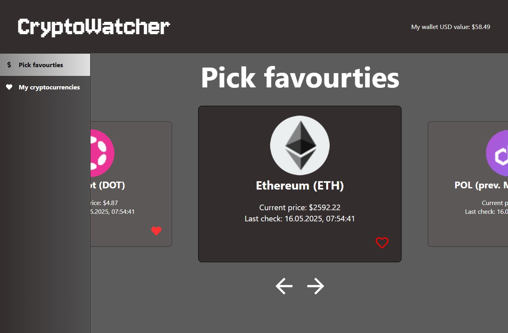

# CryptoWatcher



## Getting started

Clone repository:
```
git clone https://github.com/BlackH3art/cryptowatcher.git
```
### Backend

1. Install dependencies:
```
cd ./server
npm install
```

2. Create your `.env` based on `.env.example`
```
DATABASE_URL="file:../src/db/db.sqlite"
CMC_API_KEY="CoinMarketCap API Key"
JWT_SECRET="Some Super Secret String"
```

3. Sign up on [CoinMarketCap](https://pro.coinmarketcap.com/login) and create your `API_KEY` then update `.env`
```
...
CMC_API_KEY="51*****b-****-****-****-6**********8"
...
```
4. Run migrations to create your database:
```
npx prisma migrate dev
```

5. Generate prisma client:
```
npx prisma generate
```

6. Now you can run the app with:
``` 
npm run dev
```
____

### Frontend
1. Open new terminal and install dependencies:
```
cd ./client
npm install
```

2. Start application with:
```
npm run dev
```
## Endpoints
Swagger documentation available at `http://localhost:3000/docs`